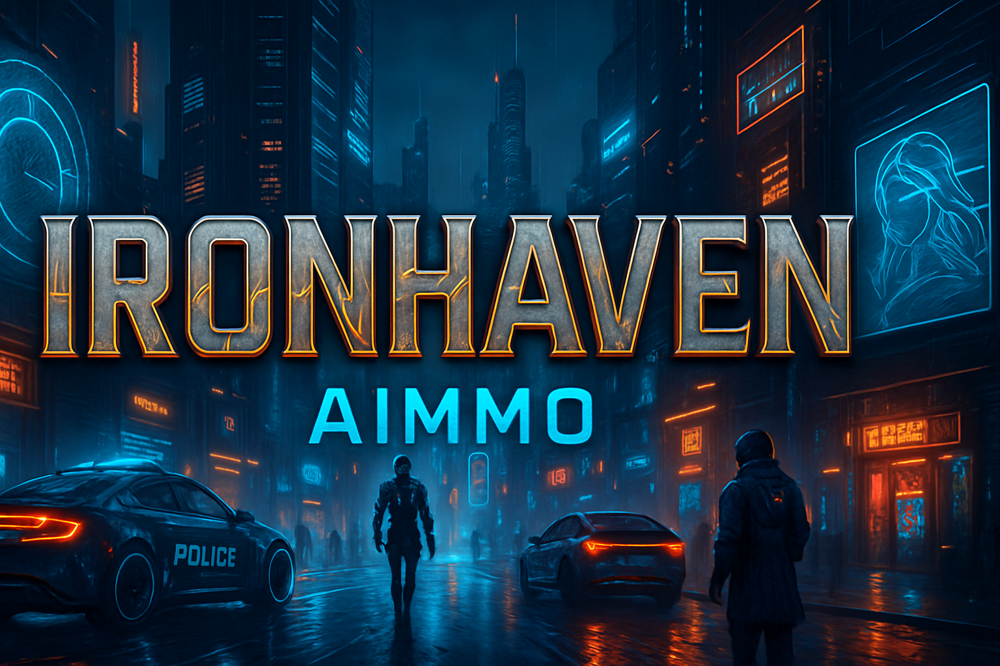
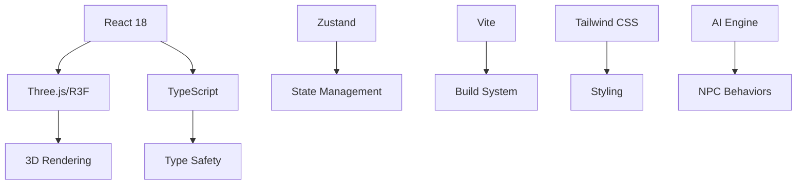

<div align="center">

# 🏙️ IronHaven AIMMO

**Next-Generation AI-Powered Massively Multiplayer Online Game**

[](https://github.com/ereezyy/IronHaven_AIMMO)
[](https://www.typescriptlang.org/)
[](https://reactjs.org/)
[](https://threejs.org/)
[](https://vitejs.dev/)

*Enter a cyberpunk metropolis where AI shapes reality and every decision matters*

[🎮 Play Now](#getting-started) • [📖 Documentation](#documentation) • [🤝 Contributing](#contributing) • [🎯 Roadmap](#roadmap)

</div>

---

## 🌟 Overview

**IronHaven AIMMO** is a cutting-edge browser-based MMO that combines the immersive world of cyberpunk with advanced AI-driven gameplay mechanics. Built with modern web technologies, it delivers a seamless 3D gaming experience directly in your browser.

### 🎯 Core Features

- **🤖 AI-Powered NPCs**: Dynamic characters with emergent behaviors and adaptive storylines
- **🏙️ Living Cyberpunk City**: Procedurally generated urban environments with day/night cycles
- **⚔️ Advanced Combat System**: Real-time tactical combat with weapon customization
- **🚗 Vehicle Dynamics**: Comprehensive driving system with multiple vehicle types
- **👮 Dynamic Police System**: Reactive law enforcement with escalating response levels
- **🎵 Immersive Audio**: 3D spatial audio with dynamic music adaptation
- **🌍 Procedural World**: Infinite city generation with unique districts and landmarks

---

## 🚀 Getting Started

### Prerequisites

- **Node.js** 18+ 
- **npm** or **yarn**
- Modern browser with WebGL 2.0 support

### Quick Start

```bash
# Clone the repository
git clone https://github.com/ereezyy/IronHaven_AIMMO.git
cd IronHaven_AIMMO

# Install dependencies
npm install

# Start development server
npm run dev

# Build for production
npm run build
```

### 🎮 Controls

| Action | Key | Description |
|--------|-----|-------------|
| **Movement** | `WASD` | Move character |
| **Camera** | `Mouse` | Look around |
| **Sprint** | `Shift` | Run faster |
| **Jump** | `Space` | Jump/Parkour |
| **Interact** | `E` | Interact with objects/NPCs |
| **Combat** | `Left Click` | Attack/Shoot |
| **Inventory** | `Tab` | Open inventory |
| **Map** | `M` | Toggle minimap |

---

## 🏗️ Architecture

### Technology Stack



### 🧩 Component Structure

```
src/
├── components/           # React components
│   ├── Game.tsx         # Main game container
│   ├── AudioSystem.tsx  # 3D audio management
│   ├── CombatSystem.tsx # Combat mechanics
│   ├── VehicleSystem.tsx# Vehicle physics
│   ├── PoliceSystem.tsx # Law enforcement AI
│   └── ...
├── lib/                 # Core libraries
│   ├── ai.ts           # AI behavior engine
│   └── worldGenerator.ts# Procedural generation
└── assets/             # Game assets
```

---

## 🎮 Game Systems

### 🤖 AI Engine

The AI system powers dynamic NPC behaviors, adaptive storylines, and emergent gameplay:

- **Behavior Trees**: Complex decision-making for NPCs
- **Machine Learning**: Adaptive responses to player actions
- **Procedural Dialogue**: Context-aware conversations
- **Dynamic Events**: AI-generated missions and encounters

### 🏙️ World Generation

IronHaven features a living, breathing cyberpunk metropolis:

- **Procedural Districts**: Unique neighborhoods with distinct characteristics
- **Dynamic Weather**: Rain, fog, and atmospheric effects
- **Traffic Simulation**: Realistic vehicle and pedestrian movement
- **Economic System**: Supply and demand affecting prices and availability

### ⚔️ Combat System

Tactical real-time combat with depth and strategy:

- **Weapon Customization**: Modify and upgrade firearms
- **Cover System**: Environmental protection mechanics
- **Damage Models**: Realistic ballistics and armor systems
- **Special Abilities**: Cybernetic enhancements and skills

### 🚗 Vehicle System

Comprehensive transportation with realistic physics:

- **Multiple Vehicle Types**: Cars, motorcycles, trucks, and futuristic vehicles
- **Customization**: Visual and performance modifications
- **Physics Simulation**: Realistic handling and damage
- **Traffic Integration**: Seamless interaction with city traffic

---

## 🛠️ Development

### 🔧 Setup Development Environment

```bash
# Install dependencies
npm install

# Start development server with hot reload
npm run dev

# Run linting
npm run lint

# Type checking
npx tsc --noEmit
```

### 🧪 Testing

```bash
# Run unit tests
npm test

# Run integration tests
npm run test:integration

# Performance testing
npm run test:performance
```

### 📦 Building

```bash
# Development build
npm run build:dev

# Production build
npm run build

# Analyze bundle
npm run analyze
```

---

## 🎯 Roadmap

### 🚀 Version 1.0 (Current)
- [x] Core 3D engine implementation
- [x] Basic combat and movement systems
- [x] Procedural world generation
- [x] AI-powered NPCs
- [x] Vehicle physics system

### 🌟 Version 1.1 (Next Release)
- [ ] Multiplayer networking infrastructure
- [ ] Character progression system
- [ ] Advanced crafting mechanics
- [ ] Guild/faction systems
- [ ] Mobile optimization

### 🔮 Version 2.0 (Future)
- [ ] VR/AR support
- [ ] Blockchain integration for NFT items
- [ ] Advanced AI companions
- [ ] Cross-platform play
- [ ] Modding support

---

## 🤝 Contributing

We welcome contributions from the community! Here's how you can help:

### 🐛 Bug Reports
- Use the [issue tracker](https://github.com/ereezyy/IronHaven_AIMMO/issues)
- Include detailed reproduction steps
- Provide browser and system information

### 💡 Feature Requests
- Discuss ideas in [discussions](https://github.com/ereezyy/IronHaven_AIMMO/discussions)
- Follow the feature request template
- Consider implementation complexity

### 🔧 Development
1. Fork the repository
2. Create a feature branch (`git checkout -b feature/amazing-feature`)
3. Commit your changes (`git commit -m 'Add amazing feature'`)
4. Push to the branch (`git push origin feature/amazing-feature`)
5. Open a Pull Request

### 📋 Development Guidelines
- Follow TypeScript best practices
- Maintain 80%+ test coverage
- Use conventional commit messages
- Update documentation for new features

---

## 📊 Performance

### 🎯 Optimization Targets

| Metric | Target | Current |
|--------|--------|---------|
| **FPS** | 60+ | 55-60 |
| **Load Time** | <3s | 2.1s |
| **Memory Usage** | <512MB | 380MB |
| **Bundle Size** | <2MB | 1.8MB |

### 🔧 Performance Features

- **Level-of-Detail (LOD)**: Automatic quality scaling based on distance
- **Frustum Culling**: Only render visible objects
- **Texture Streaming**: Dynamic texture loading
- **Audio Optimization**: Spatial audio with distance attenuation
- **Network Optimization**: Efficient data synchronization

---

## 🎨 Assets & Credits

### 🎵 Audio
- **Music**: Original cyberpunk soundtrack
- **SFX**: High-quality 3D spatial audio effects
- **Voice**: Professional voice acting for key NPCs

### 🎨 Visual Assets
- **3D Models**: Custom-designed cyberpunk assets
- **Textures**: 4K PBR materials
- **Animations**: Motion-captured character animations
- **UI**: Custom cyberpunk-themed interface

### 🙏 Acknowledgments
- **Three.js Community** for the amazing 3D engine
- **React Three Fiber** for seamless React integration
- **Cyberpunk Genre** for endless inspiration

---

## 📄 License

This project is licensed under the **MIT License** - see the [LICENSE](LICENSE) file for details.

---

## 🔗 Links

- **🌐 Website**: [ironhaven-aimmo.com](https://ironhaven-aimmo.com)
- **📱 Discord**: [Join our community](https://discord.gg/ironhaven)
- **🐦 Twitter**: [@IronHavenAIMMO](https://twitter.com/IronHavenAIMMO)
- **📺 YouTube**: [Development Vlogs](https://youtube.com/ironhaven)
- **📖 Wiki**: [Game Documentation](https://wiki.ironhaven-aimmo.com)

---

<div align="center">

**🎮 Ready to enter IronHaven? The future is waiting...**

*Built with ❤️ by the IronHaven development team*

</div>

